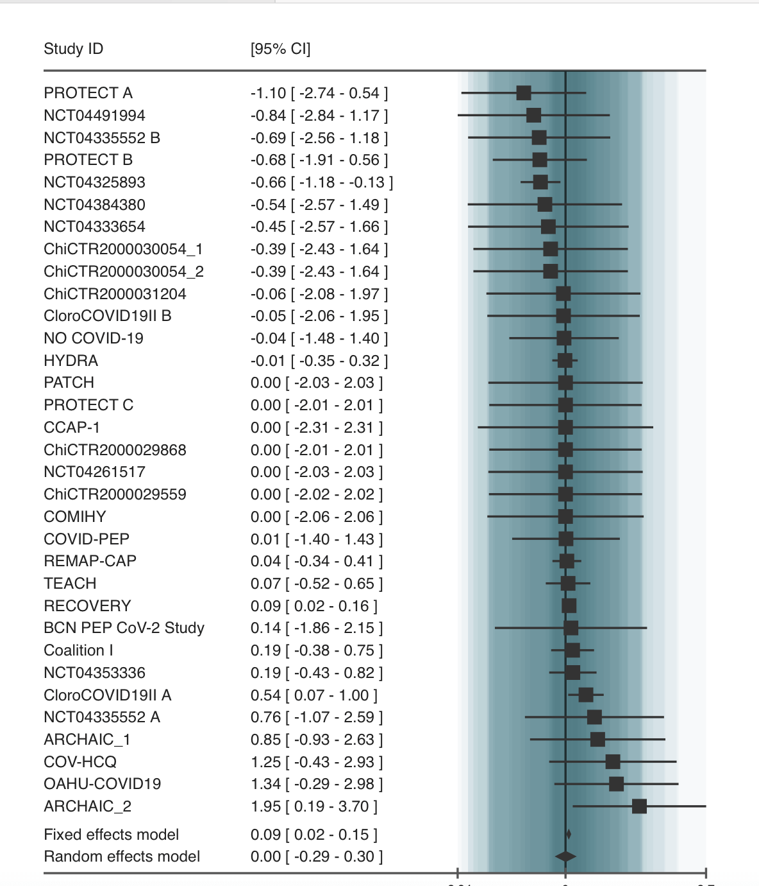

<link
  rel="stylesheet"
  href="https://stackpath.bootstrapcdn.com/bootstrap/4.1.3/css/bootstrap.min.css"
  integrity="sha384-MCw98/SFnGE8fJT3GXwEOngsV7Zt27NXFoaoApmYm81iuXoPkFOJwJ8ERdknLPMO"
  crossorigin="anonymous"
/><link rel="stylesheet" href="styles/styles.css">

# Simple explanation

## Don't get our plots? Here's a simple guide…

Let's take an example - our [hydroxychloroquine study](studies/dat.axfors2021). The question is how effective hydroxychloroquine is at stopping covid. Here is what an example plot would look like. 

### What each part means

- **Each line with a ■** : That's like one doctor's experiment.
  - The little ■ tells us what that one doctor found
  - If the ■ is on the **left side** of the middle line |, that doctor thought the medicine helped
  - If the ■ is on the **right side** of |, that doctor thought the medicine didn't help, or maybe even made things a tiny bit worse
  - So you can think of the horizontal line | as the "maybe line": whether something is to the left or right of it determines if it helped or not.
  - The **bigger the ■**, the more patients were in that doctor's experiment, so we trust that doctor's finding a bit more

- **The line through the square** ─: This shows how sure the doctor is
  - If the line is really long, the doctor isn't super sure about their finding
  - If the line is short, they are more sure
  - If a doctor's square and/or its vertical line ─ cross this horizontal line in the middle |, it means that doctor's experiment wasn't big enough or clear enough to say for sure if the medicine helped or not

- **The diamond at the bottom (the fixed effects model)** ◆: This is the big summary of what everyone found
  - If the diamond ◆ is on the **left side** of the "maybe line," it means when you look at all the experiments together, the medicine seems to help
  - If the diamond ◆ is on the **right side**, it means putting all the experiments together suggests the medicine doesn't help, or might even be a little bit bad
  - If the diamond ◆ crosses the horizontal "maybe line," | even with all the experiments together, we still can't say for sure if the medicine helps or not

### Fixed and random effects: how do the models differ?

When we combine results from different studies looking at whether hydroxychloroquine helps for COVID, we need a way to average the findings. The Fixed Effects method assumes that hydroxychloroquine has one single, true effect on all COVID patients, and any differences in what each study found are just due to random chance because they looked at different groups of patients; it tries to find this one true effect, giving more importance to results from the biggest studies. The Random Effects method is different because it thinks the effect of hydroxychloroquine might actually vary a little bit from one study to another (maybe it works slightly differently in older patients, or those with more severe illness, or depending on other treatments they received); it pools the results by accounting for both random chance and this expected variation in effect size between different studies, usually giving an overall result that has a wider range of uncertainty to reflect those differences.

### What this picture tells us

This picture is a way to see, all in one place, what lots of different studies found about giving hydroxychloroquine for COVID. The diamond ◆ at the bottom gives us the best guess from all the information combined.

Looking at the picture, the diamond ◆ at the bottom seems to be mostly or entirely on the right side of the middle line, or crossing it but leaning right (at least in the fixed effects model). This suggests that when scientists put together all the studies, the results don't show that hydroxychloroquine helps people with COVID, and might even suggest it could be slightly harmful, or at best, it doesn't make a clear positive difference.

Hopefully this makes sense! This basic structure of the plot works for all the studies on the website, no matter the question. 

